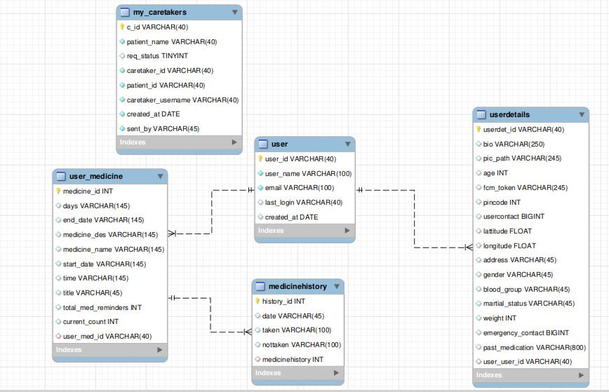
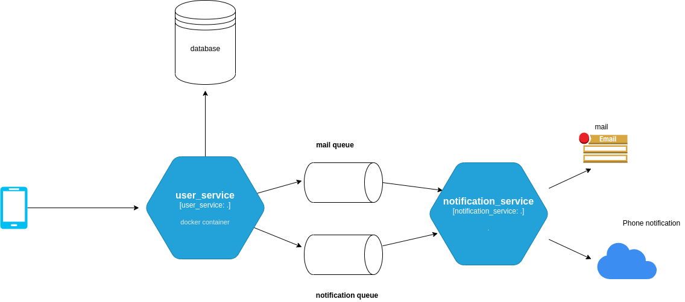
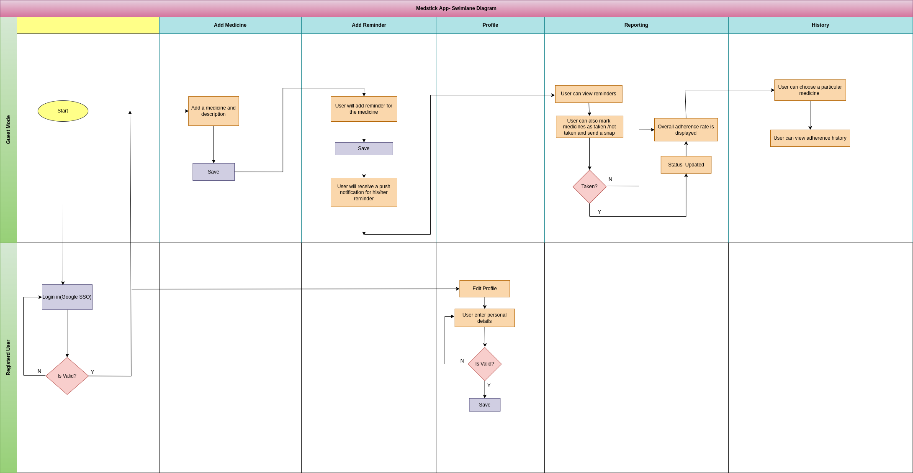

Medicine Adherence Application 
===

We would like to create an APP for users which will serve as a medicine adherence module.
Many of the diseases require the patient to take medicines at a regular interval. Some of the diseases like BP, Diabetes, Tuberculosis have really strict norms about taking medicines. In case the medicine is not taken in time then the patient’s health is impacted negatively. 

## Project Structure
```
user_service
│  └───src
│    └───main
│     │   └───java
│     │   │     └───com.example.user_service
│     │   │         └───annotations
│     │   │         └───config
│     │   │         └───controller
│     │   │         └───excecption
│     │   │         └───model
│     │   │         └───pojos
│     │   │         └───repository
│     │   │         └───security
│     │   │         └───service
│     │   │         └───util
│     │   │         └───EventFinderBackendApplication.java
│     │   └───resources
│     │       └─── application.properties
└───...
```
## Getting Started

### Prerequisites

* Java 11
* Maven 3.0+: https://maven.apache.org/install.html
* An IDE (Intellij Idea Community Edition) : https://www.jetbrains.com/idea/download/#section=linux
* Gradle : https://docs.gradle.org/current/userguide/installation.html
* MySQL : https://dev.mysql.com/downloads/installer/

### Installing
To create your own Spring Boot-based project use
* Spring Initializr : https://start.spring.io/

  Initializr generates spring boot project with just what you need to start quickly!


Building the project
====================
To do the full build, do: `mvn clean install`

Building a single module
====================
To build a specific module run the command: `mvn clean install` in the module directory


Running a Spring Boot module
====================
To run a Spring Boot module run the command: `mvn spring-boot:run` in the module directory

# Set up the RabbitMQ Broker

Before you can build your email service application, you need to set up a server to handle receiving and sending messages.

RabbitMQ is an AMQP server. The server is freely available at https://www.rabbitmq.com/download.html. You can download it manually or, if you use a Mac with Homebrew, by running the following command in a terminal window:

``brew install rabbitmq``

Unpack the server and launch it with default settings by running the following command in a terminal window:

`rabbitmq-server`

# Security

Integration with Spring Security and add other filter for jwt token process.

The secret key is stored in `application.properties`.

# Database

It uses MySql database, can be changed easily in the `application.properties` for any other database.



# System Design



# Swimlane Diagram

Flowchart that show both process from start to finish and who is responsible for each step in the process.


Working with the IDE
====================
This repo contains a large number of modules.
When you're working with an individual module, there's no need to import all of them (or build all of them) - you can simply import that particular module in either Eclipse or IntelliJ. 

## Deployment

Add additional notes about how to deploy this on a live system
### Try it out with [Docker](https://www.docker.com/)

You'll need Docker and Ngrok installed and create docker image for your project
        
     ngrok http 8080
     sudo docker run --network "host" -p 800:8080 user_service:0.0.1-SNAPSHOT

# Try it out with a RealWorld frontend

The entry point address of the backend API is at http://localhost:8080

## Help

Any advise for common problems or issues.

* Clear the system cache
* From the main menu, select File | Invalidate Caches.
* In the Invalidate Caches dialog, you can select additional actions that the IDE will perform while removing the cache files
* Click Invalidate and Restart.

## Authors

Contributors names and contact info

* Yatin Tripathi : https://github.com/yatintri
* Nikunj Bisht : https://github.com/Nikunj-bisht
* Vinay Kumar Soni : https://github.com/Vinaysoni1206

## Acknowledgments

* https://www.baeldung.com/
* https://spring.io/guides/gs/caching/
* https://www.rabbitmq.com/
